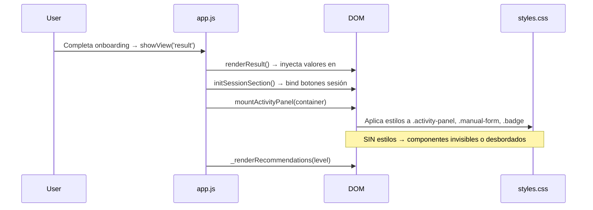

# Design Document: ui-result-components

## Overview

Este diseño aborda las correcciones necesarias para que las cinco secciones funcionales de la Vista de Resultado (`#view-result`) se rendericen correctamente en dispositivos móviles (≤ 480px). El problema actual es que el HTML y los módulos JS existen, pero ciertos componentes no aparecen visualmente cuando se accede desde un navegador móvil vía ngrok.

Las áreas de corrección se dividen en:
1. **CSS responsive faltante** — Estilos para el panel montado dinámicamente (`activity-panel.js`) que no existen en `styles.css`.
2. **Inicialización robusta** — Garantizar que el montaje dinámico y la inyección de contenido no fallen silenciosamente.
3. **Layout móvil** — Ajustes de flex-direction, overflow y touch targets para viewport ≤ 480px.

### Decisiones de diseño clave

- **No se introduce framework CSS ni librería adicional.** Se mantiene el enfoque vanilla CSS con custom properties ya definidas en `:root`.
- **Los estilos del panel dinámico se agregan a `styles.css`**, no en un archivo separado, para mantener la convención actual de un solo archivo de estilos.
- **Las correcciones JS son defensivas** — verifican existencia de elementos DOM antes de operar, sin cambiar la arquitectura de la SPA.
- **Mobile-first corrections** — Las reglas nuevas se enfocan en ≤ 480px pero no rompen la vista en pantallas más grandes.

## Architecture

```mermaid
graph TD
    subgraph "Vista Resultado (#view-result)"
        A[Gauge + Risk Badge]
        B[Provisional Note]
        C[Detail Cards]
        D[Result Message<br/>#result-message]
        E[Activity Section<br/>.activity-section]
        F[Activity Panel Mount<br/>#activity-panel-mount]
        G[Recommendations Section<br/>.recommendations-section]
        H[Disclaimer + Redo Button]
    end

    subgraph "Montaje Dinámico"
        F --> |mountActivityPanel| I[activity-panel.js]
        I --> J[.activity-panel]
        J --> K[.bt-section<br/>Bluetooth button]
        J --> L[.manual-form<br/>Entrada manual]
        J --> M[.sources-status<br/>Badges estado]
    end

    subgraph "CSS (styles.css)"
        N[Estilos existentes<br/>gauge, detail-cards,<br/>activity-section, session-*]
        O[Estilos NUEVOS<br/>.activity-panel, .manual-form,<br/>.badge, .bt-section,<br/>responsive ≤480px]
    end

    style O fill:#1a4a1a,stroke:#34d073
```



### Flujo de renderizado en móvil



## Components and Interfaces

### 1. Estilos CSS nuevos (`styles.css`)

Se agregan reglas para las clases generadas por `activity-panel.js` que actualmente no tienen estilo:

| Clase | Propósito | Corrección |
|-------|-----------|------------|
| `.activity-panel` | Contenedor del panel montado | Card styling (background, border, padding, border-radius) |
| `.panel-title` | Título "Actividad de hoy" del panel | Font-size, weight, color |
| `.activity-summary` | Resumen de minutos activos | Layout flex column, centrado |
| `.minutes-value` | Número grande de minutos | Font-size 2rem+, font-weight 800 |
| `.minutes-label` | Etiqueta "minutos activos" | Font-size small, color muted |
| `.source-label` | Fuente activa actual | Font-size small, color muted |
| `.sources-status` | Contenedor de badges | Flex wrap, gap |
| `.badge` | Badge de estado de fuente | Inline-flex, pill shape, font-size small |
| `.badge--active` | Badge activo (verde) | Color success |
| `.badge--inactive` | Badge inactivo (gris) | Color muted |
| `.badge--unavailable` | Badge no disponible (rojo) | Color danger |
| `.badge--primary` | Badge de fuente principal | Ring/highlight accent |
| `.bt-section` | Contenedor del botón Bluetooth | Flex column, gap |
| `.status-msg` | Mensajes de estado BT | Font-size small |
| `.status-msg--info` | Info | Color accent |
| `.status-msg--success` | Éxito | Color success |
| `.status-msg--warn` | Warning | Color warn |
| `.manual-form` | Formulario de entrada manual | Card interior, padding |
| `.manual-form__title` | Título "Ingresar manualmente" | Font-size, weight |
| `.manual-form__hint` | Texto de ayuda | Font-size small, color muted |
| `.manual-form__row` | Row de inputs: select + input + button | Flex row → column en móvil |
| `.manual-form--highlighted` | Estado resaltado tras fallo BT | Border accent |
| `.input` | Estilo base de inputs | Height 44px, padding, border |
| `.input--select` | Select específico | Appearance, custom arrow |
| `.input--number` | Input numérico | Width flexible |
| `.btn--secondary` | Botón secundario (Guardar manual) | Background surface, border accent |
| `.msg` | Mensajes de feedback | Font-size small |
| `.msg--error` | Error | Color danger |
| `.msg--success` | Éxito | Color success |

### 2. Media query responsive (≤ 480px)

Reglas específicas dentro de `@media (max-width: 480px)`:
- `.manual-form__row`: `flex-direction: column` para apilar select, input y botón verticalmente.
- `.activity-panel`: padding reducido para aprovechar ancho.
- `.sources-status`: `flex-wrap: wrap` para que badges se acomoden.
- `.result-message`: `word-wrap: break-word; overflow-wrap: break-word` para evitar desbordamiento.
- Touch targets: min-height 44px en botones, inputs y áreas interactivas.
- `.recommendations-section`: padding lateral ajustado.
- `.recommendation-item__check`: min-width/min-height 44px.

### 3. Correcciones defensivas en JS (`app.js`)

| Función | Corrección |
|---------|-----------|
| `renderResult()` | Verificar que `#result-message` existe antes de `innerHTML`; si no existe, crearlo y appendearlo al container |
| `mountActivityPanel()` | Envolver en try/catch, log error en consola sin bloquear |
| `_renderRecommendations()` | Si `#recommendations-list` no existe, no intentar innerHTML |

### 4. Correcciones en `activity-panel.js`

| Función | Corrección |
|---------|-----------|
| `mountActivityPanel()` | Verificar `container` no es null antes de operar; retorno temprano con `console.error` si falla |
| `_bindElements()` | Cada query puede retornar null — verificar antes de `addEventListener` |

## Data Models

No se introducen nuevos modelos de datos. Las correcciones son puramente de presentación (CSS) y robustez de inicialización (JS defensivo).

Los datos que fluyen hacia los componentes visuales mantienen su estructura actual:

```javascript
// Resultado del onboarding (ya existente)
{
  score: number,           // 0-100
  level: 'low'|'medium'|'high',
  label: string,
  activeMinutesPerDay: number,
  deficitMinutes: number,
  projectedStrengthLoss30d: number,
  projectedVO2Loss30d: number,
}

// Recomendación (ya existente)
{
  id: string,
  text: string,
  minutes: number,
  source: string,
  completed: boolean,
}

// DailyRecord del activity-manager (ya existente)
{
  activeMinutes: number,
  primarySource: 'bluetooth'|'motion'|'manual'|'none',
}
```

## Error Handling

| Escenario | Comportamiento esperado |
|-----------|------------------------|
| `#result-message` no existe en DOM | `renderResult()` crea el elemento dinámicamente y lo inserta antes de la sección de actividad |
| `#activity-panel-mount` es null | `mountActivityPanel()` hace `console.error('[ActivityPanel] Container not found')` y retorna sin bloquear |
| `#recommendations-list` es null | `_renderRecommendations()` retorna sin operar |
| Web Bluetooth no disponible | Badge muestra "no disponible", botón deshabilitado (ya implementado, solo necesita estilos visibles) |
| Sensor de movimiento denegado | Panel de diagnóstico visible con detalles técnicos (ya implementado, solo necesita estilos visibles) |
| CSS no carga por alguna razón | Los componentes siguen en el DOM (funcionales vía JS), solo sin estilo visual — no hay crash |

## Testing Strategy

### Por qué NO se usa Property-Based Testing

Esta feature trata exclusivamente de:
- Correcciones de CSS responsive (layout visual)
- Robustez de montaje dinámico de DOM
- Visibilidad de componentes en viewport móvil

Estos son aspectos de **UI rendering y layout**, que no tienen propiedades universales cuantificables con inputs generados. No hay funciones puras con input/output variable que validar. Las verificaciones son binarias: "el elemento es visible" o "no lo es".

### Estrategia de testing recomendada

**1. Tests manuales en dispositivo real (prioritario)**
- Acceder vía ngrok desde Chrome Android y Safari iOS
- Verificar que cada una de las 5 secciones es visible y funcional
- Verificar touch targets ≥ 44px con herramientas de inspección móvil

**2. Tests de ejemplo con DevTools**
- Chrome DevTools → Device Mode → 375×667 (iPhone SE), 390×844 (iPhone 14)
- Verificar: no hay overflow-x en `<body>`, no hay texto cortado, badges visibles

**3. Tests unitarios (example-based)**
- `renderResult()`: dado un resultado con level='high', verificar que `#result-message` contiene texto con valores numéricos
- `mountActivityPanel()`: dado un container válido, verificar que `.activity-panel` existe como child
- `mountActivityPanel()`: dado null como container, verificar que no lanza excepción
- `_renderRecommendations('medium')`: verificar que genera ≤ 3 items en `#recommendations-list`
- `_renderRecommendations('low')`: verificar que muestra mensaje de nivel adecuado

**4. Snapshot visual (opcional, si hay tiempo)**
- Captura de pantalla automatizada con Playwright en viewport 375px
- Comparación contra baseline para detectar regresiones

### Cobertura por requisito

| Requisito | Tipo de test |
|-----------|-------------|
| R1 — Mensaje contextual | Manual + unit test (contenido HTML correcto) |
| R2 — Sección actividad | Manual (visibilidad), unit test (estados de sesión) |
| R3 — Panel wearable | Manual (montaje), unit test (container null) |
| R4 — Entrada manual | Manual (layout vertical en móvil), unit test (validación) |
| R5 — Recomendaciones | Manual (touch targets), unit test (render por nivel) |
| R6 — Estilos CSS | Manual (inspección visual en DevTools mobile mode) |
